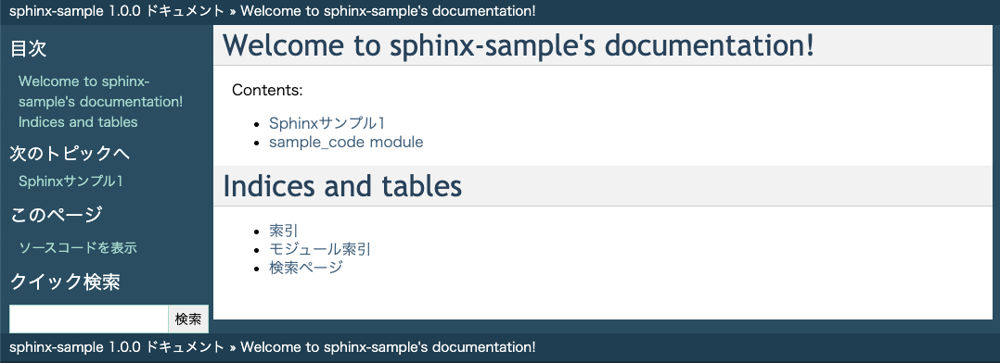

# How to create Sphinx document

## set target Python file

```shell
tourch ./src/sample_code.py
# implement class or function for sample_code.py
```

## make HTML document

```shell
sphinx-apidoc -f -o ./source/ ./src/
make html
```

## show ./build/html/index.html on your browser

